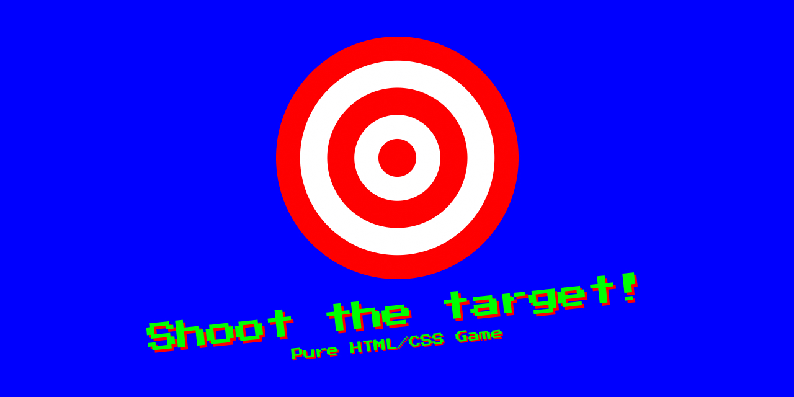

Try it! https://shoot-target-css-game.netlify.com

This game is made entirely with HTML and CSS. Shoot as many targets as you can!

It has been made thanks to this amazing CSS features:

- [Counters](https://developer.mozilla.org/en-US/docs/Web/CSS/CSS_Lists_and_Counters/Using_CSS_counters)
- [Custom Properties](https://developer.mozilla.org/en-US/docs/Web/CSS/--*)
- [Custom cursor](https://developer.mozilla.org/en-US/docs/Web/CSS/CSS_Basic_User_Interface/Using_URL_values_for_the_cursor_property) using an [SVG data url](https://stackoverflow.com/a/46017733/2767771)
- [Animations](https://developer.mozilla.org/en-US/docs/Web/CSS/CSS_Animations) and the ability to pause them with [`animation-play-state`](https://developer.mozilla.org/en-US/docs/Web/CSS/animation-play-state)
- [`:target`](https://developer.mozilla.org/en-US/docs/Web/CSS/:target) pseudo-class
- [Radial Gradients](https://developer.mozilla.org/en-US/docs/Web/CSS/radial-gradient)
- [`pointer-events`](https://developer.mozilla.org/en-US/docs/Web/CSS/pointer-events)

If you wanna read how to build this game step by step read [the post](https://octuweb.com/html-css-dan-mucho-juego/) I wrote for Octuweb 2018 (in spanish).

> I made the first version of this game for the [Alicante Codepen Meetup](https://www.meetup.com/Alicante-Frontend/events/243642935/) on December 12, 2017. It's hosted [on CodePen](https://codepen.io/aarongarciah/pen/ypBoVm).
> 
> Then, I made a second and improved version of the game on October 1, 2018 for the ["🎯 HTML + CSS dan mucho juego"](https://octuweb.com/html-css-dan-mucho-juego/) (in spanish) article published in [Octuweb](https://octuweb.com) 2018. It's hosted [on CodePen](https://codepen.io/aarongarciah/pen/BOEZvY).
> 
> This final versions has a couple of tweaks but it's pretty much the same version than 2018.

## Improvements

- [ ] Add link to restart game

## License

MIT

Made with ♥️ by [Aarón García Hervás](https://aarongarciah.com)
